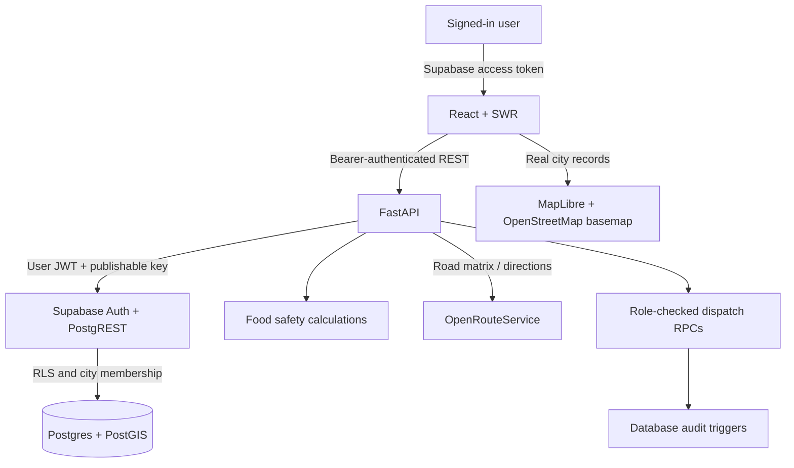

# AaharSetu (आहारसेतु) — Real-Time Food Rescue Routing & Safety Network

> *"Turn a restaurant's unsold food into a shelter's next meal, before it hits the dumpster."*

**AMIHACKS 1.0 | Track A: NGO / Social Impact**  
**Indian City Pilot Architecture**

[](https://react.dev/)
[](https://fastapi.tiangolo.com/)
[](https://supabase.com/)
[](https://github.com/omprakashjaat1306/AMITY)

---

## 🌟 The Problem
Surplus prepared food from commercial kitchens, weddings, corporate cafeterias, and restaurants has a usable window of only **2 to 6 hours**. Traditional rescue networks rely on manual phone calls, WhatsApp groups, and spreadsheets. By the time a volunteer is coordinated, the safe consumption window has closed, resulting in food waste and liability risk.

**AaharSetu** solves this with an end-to-end platform combining AI-assisted intake, dynamic FSSAI food-safety countdowns, transparent 5-factor scoring, joint multi-vehicle routing (VRP with time windows), and QR/OTP cryptographic handovers.

---

## 🚀 Key Innovations

### 1. FSSAI / IFSA Dynamic Safety Countdown Engine
Per Indian Food Safety and Standards Authority (FSSAI Surplus Food Regulations, 2019):
- **Hot-hold food ($\ge 60^\circ\text{C}$):** Safe window is **4.0 hours**.
- **Cooked food below $65^\circ\text{C}$:** Strictly restricted to a **2.0-hour** safe window.
- **Cold-chain food ($\le 5^\circ\text{C}$):** Safe for **6.0 hours**.
- **Cold chain broken ($> 5^\circ\text{C}$):** Automatically truncated to **2.5 hours**.
- **Hard Filter:** If travel time + 35 min buffer exceeds remaining safe window, the system automatically blocks dispatch.

### 2. Multi-Factor Transparent Matching
Every match is computed dynamically using an explainable formula:
$$\text{Score} = 0.35 \times S_{\text{urgency}} + 0.25 \times S_{\text{proximity}} + 0.20 \times S_{\text{need}} + 0.10 \times S_{\text{capacity}} + 0.10 \times S_{\text{reliability}}$$
- Displays transparent breakdown percentages directly to coordinators.
- Enforces strict constraints: recipient must be open, verified, have sufficient reserved capacity, and accept the food category (veg/non-veg/perishable).

### 3. Road-Based Route Comparison
- OpenRouteService matrix data orders up to six active pickup stops for one available driver.
- A nearest-road baseline is compared with a deadline-aware ordering; OpenRouteService directions provide road distance and arrival-time checks.
- Results depend on actual registered city data, available drivers, current ORS coverage, and the provider response. This is a route comparison, not a fleet-wide VRP or delivery guarantee.

### 4. Account-Verified Handover
- An assigned driver confirms pickup through an authenticated account.
- An assigned recipient confirms delivery through an authenticated account.
- Supabase role and record policies validate the assignment and allowed state transition; database triggers create dispatch history and delivery records.

---

## 🏛️ System Architecture



See [the current architecture and rollout notes](docs/current-architecture.md) for the security model, database setup, and real-data provisioning requirements.

---

## 💻 Tech Stack

- **Frontend:** React 19, TypeScript, Vite, Tailwind CSS v4, Lucide Icons, Sonner toasts, SWR data synchronization, MapLibre GL.
- **Backend:** FastAPI, Python 3.11, Pydantic v2, httpx, Uvicorn.
- **Database & Auth:** Supabase Auth + Postgres/PostGIS. The API forwards each signed-in user's JWT; it does not use a service-role key.
- **Maps & routing:** MapLibre with OpenStreetMap-derived tiles, plus server-side OpenRouteService directions and matrix requests.
- **City scope:** A shared city directory currently covers Bengaluru, Mumbai, Delhi, Chennai, Hyderabad, Pune, Kolkata, Ahmedabad, Jaipur, and Lucknow.
- **Design System:** Custom **AaharSetu Earth & Rescue Design System** generated via Stitch MCP:
  - `#1B4D3E` (Deep Emerald - Trust & Vitality)
  - `#E07A5F` (Terracotta Urgency - Actionable Alerts)
  - `#2A9D8F` (Safety Teal - Certified Hygiene)
  - `#F7F8F5` (Ivory Sand - Organic Canvas)

---

## ⚡ Quick Start

### Prerequisites
- Node.js (v18+)
- Python 3.10+
- Git

### 1. Clone & Install Frontend
```bash
git clone https://github.com/omprakashjaat1306/AMITY.git AaharSetu
cd AaharSetu
npm install
```

### 2. Set Up Backend (Python)
```bash
pip install -r backend/requirements.txt
```

### 3. Environment Variables
Create `.env` in the root folder (or use `.env.example`):
```env
VITE_SUPABASE_URL=https://your-project.supabase.co
VITE_SUPABASE_KEY=your_supabase_publishable_or_anon_key_here
SUPABASE_URL=https://your-project.supabase.co
SUPABASE_PUBLISHABLE_KEY=your_supabase_publishable_or_anon_key_here
GEMINI_API_KEY=your_gemini_api_key_here
ORS_API_KEY=your_openrouteservice_key_here
TELEGRAM_BOT_TOKEN=your_telegram_bot_token
TELEGRAM_CHAT_ID=your_telegram_destination_id
ALLOWED_ORIGINS=http://localhost:3000,http://127.0.0.1:3000
```
`.env` is gitignored. Offline mode displays only the Bengaluru synthetic demo and disables writes. With Supabase configured, the app requires sign-in and does not substitute demo records when the API fails. ORS routes are unavailable until `ORS_API_KEY` is configured. Telegram is not enabled until a destination and notification flow are configured.

### 4. Apply the database schema
Run `supabase/schema.sql` in the Supabase SQL editor. Existing Bengaluru rows receive the `blr` city id; real records remain visible only through the new RLS policies. New users receive a donor role by default. A trusted administrator must provision their requested role and associate the account with its donor, driver, or recipient record. To promote the initial coordinator, do so from the SQL editor after verifying the account:

```sql
UPDATE public.profiles SET role = 'coordinator' WHERE email = 'verified-coordinator@example.org';
```

The city selector changes a user's active city preference; RLS still limits records to their assigned city and linked entities. The selected city shows no operational locations until real records have been registered for it.

### 5. Run Locally
To run both backend and frontend concurrently:
```bash
npm run dev:all
```
Or run individually:
- **Frontend:** `npm run dev` (runs on `http://localhost:3000`)
- **Backend:** `npm run backend` (runs on `http://localhost:8000`)

---

## 🧪 Local Preview and Live Setup

1. With no Supabase environment configured, open `http://localhost:3000/` to inspect the Bengaluru synthetic preview. Mutations are disabled.
2. For a live network, apply `supabase/schema.sql`, configure the environment, and provision account-linked city locations as described above.
3. Sign in with a provisioned account. Dashboard records and map pins come from that account's RLS-visible Supabase rows.
4. A donor with a registered donor location can post a donation. A coordinator can request matching and road-route comparison. The assigned driver and recipient confirm their own stages.
5. Route and impact views show current database data. They do not use the old fabricated benchmark or synthetic handover confirmation flow.

---

## 📜 Regulatory Reference & Compliance
- **FSSAI:** [Food Safety and Standards (Recovery & Distribution of Surplus Food) Regulations, 2019](https://www.fssai.gov.in/)
- **IFSA:** [Indian Food Sharing Alliance Guidelines for Cooked Surplus Food](https://sharefood.eatrightindia.gov.in/)
- **Methodology & Emission Factors:** 1.8 meals / kg food rescued; 2.5 kg CO₂e / kg avoided (within IPCC / FAO pilot standard bounds).

---

## 👥 Authors
Built for **AMIHACKS 1.0 (Amity University)**  
Track A: NGO / Social Impact
