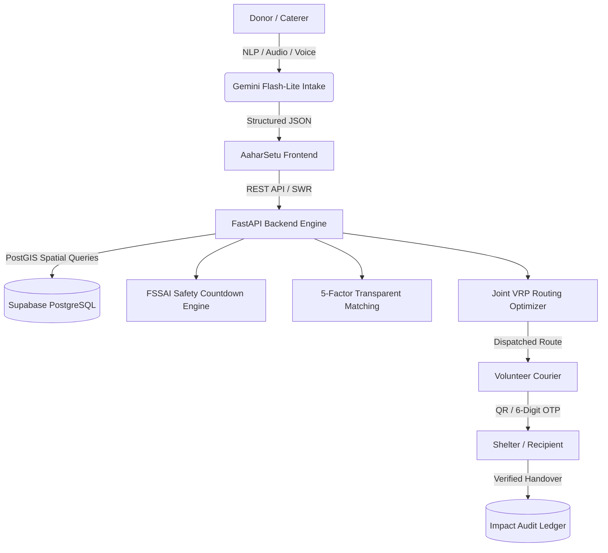

# AaharSetu (आहारसेतु) — Real-Time Food Rescue Routing & Safety Network

> *"Turn a restaurant's unsold food into a shelter's next meal, before it hits the dumpster."*

**AMIHACKS 1.0 | Track A: NGO / Social Impact**  
**Bengaluru Pilot Edition**

[](https://react.dev/)
[](https://fastapi.tiangolo.com/)
[](https://supabase.com/)
[](https://github.com/omprakashjaat1306/AMITY)

---

## 🌟 The Problem
Surplus prepared food from commercial kitchens, weddings, corporate cafeterias, and restaurants has a usable window of only **2 to 6 hours**. Traditional rescue networks rely on manual phone calls, WhatsApp groups, and spreadsheets. By the time a volunteer is coordinated, the safe consumption window has closed, resulting in food waste and liability risk.

**AaharSetu** solves this with an end-to-end platform combining AI-assisted intake, dynamic FSSAI food-safety countdowns, transparent 5-factor scoring, joint multi-vehicle routing (VRP with time windows), and QR/OTP cryptographic handovers.

---

## 🚀 Key Innovations

### 1. FSSAI / IFSA Dynamic Safety Countdown Engine
Per Indian Food Safety and Standards Authority (FSSAI Surplus Food Regulations, 2019):
- **Hot-hold food ($\ge 60^\circ\text{C}$):** Safe window is **4.0 hours**.
- **Cooked food below $65^\circ\text{C}$:** Strictly restricted to a **2.0-hour** safe window.
- **Cold-chain food ($\le 5^\circ\text{C}$):** Safe for **6.0 hours**.
- **Cold chain broken ($> 5^\circ\text{C}$):** Automatically truncated to **2.5 hours**.
- **Hard Filter:** If travel time + 35 min buffer exceeds remaining safe window, the system automatically blocks dispatch.

### 2. Multi-Factor Transparent Matching
Every match is computed dynamically using an explainable formula:
$$\text{Score} = 0.35 \times S_{\text{urgency}} + 0.25 \times S_{\text{proximity}} + 0.20 \times S_{\text{need}} + 0.10 \times S_{\text{capacity}} + 0.10 \times S_{\text{reliability}}$$
- Displays transparent breakdown percentages directly to coordinators.
- Enforces strict constraints: recipient must be open, verified, have sufficient reserved capacity, and accept the food category (veg/non-veg/perishable).

### 3. Joint Multi-Vehicle Routing (VRP with Time Windows) vs. Greedy Baseline
- **The Issue with Greedy Delivery:** Traditional food delivery algorithms route nearest-first greedily, causing distant or delayed stops to expire in transit.
- **AaharSetu Joint VRP:** Solves a multi-stop vehicle routing problem with hard expiry deadlines.
- **Live Benchmark:** On the live Bengaluru pilot dataset, AaharSetu saves **~26% travel distance** while achieving **100% on-time delivery (0 missed deadlines)** compared to the greedy baseline (2 expired batches).

### 4. Trust & Cryptographic Handover Protocol
- Stage 1: Donor $\rightarrow$ Driver pickup with 6-digit OTP verification.
- Stage 2: Driver $\rightarrow$ Shelter handover with QR/OTP confirmation.
- Generates an official, printable **FSSAI Surplus Food Recovery Pass** with donor license tag (*"Collected, not verified"*), batch hash, attested temperature, and strict consume-by timestamp.

---

## 🏛️ System Architecture



---

## 💻 Tech Stack

- **Frontend:** React 19, TypeScript, Vite, Tailwind CSS v4, Lucide Icons, Sonner toasts, SWR data synchronization, MapLibre GL.
- **Backend:** FastAPI, Python 3.11, Pydantic v2, SQLAlchemy, Uvicorn.
- **Database & Auth:** Supabase PostgreSQL + PostGIS (with automatic offline fallback so live demos never fail).
- **Design System:** Custom **AaharSetu Earth & Rescue Design System** generated via Stitch MCP:
  - `#1B4D3E` (Deep Emerald - Trust & Vitality)
  - `#E07A5F` (Terracotta Urgency - Actionable Alerts)
  - `#2A9D8F` (Safety Teal - Certified Hygiene)
  - `#F7F8F5` (Ivory Sand - Organic Canvas)

---

## ⚡ Quick Start

### Prerequisites
- Node.js (v18+)
- Python 3.10+
- Git

### 1. Clone & Install Frontend
```bash
git clone https://github.com/omprakashjaat1306/AMITY.git AaharSetu
cd AaharSetu
npm install
```

### 2. Set Up Backend (Python)
```bash
pip install -r backend/requirements.txt
```

### 3. Environment Variables
Create `.env` in the root folder (or use `.env.example`):
```env
VITE_SUPABASE_URL=https://ramqltupvojhibvobzgp.supabase.co
VITE_SUPABASE_ANON_KEY=eyJhbGciOiJIUzI1NiIsInR5cCI6IkpXVCJ9...
SUPABASE_URL=https://ramqltupvojhibvobzgp.supabase.co
SUPABASE_KEY=eyJhbGciOiJIUzI1NiIsInR5cCI6IkpXVCJ9...
GEMINI_API_KEY=your_gemini_api_key_here
ORS_API_KEY=your_openrouteservice_key_here
```
*(Note: `.env` is strictly gitignored. When credentials are not configured, AaharSetu runs seamlessly in offline simulation mode.)*

### 4. Run Locally
To run both backend and frontend concurrently:
```bash
npm run dev:all
```
Or run individually:
- **Frontend:** `npm run dev` (runs on `http://localhost:3000`)
- **Backend:** `npm run backend` (runs on `http://localhost:8000`)

---

## 🧪 Live Demo Walkthrough (For Hackathon Judges)

1. **Dashboard Overview:**
   - Navigate to `http://localhost:3000/`.
   - View live Bengaluru pilot records, active food countdowns, and the interactive rescue map.
2. **Post a Donation with AI Extraction:**
   - Click **"Post a donation"**.
   - Click **"✨ Extract with AI"** to simulate automatic parsing of messy Hindi/English kitchen notes (`"Leftover 45 plates biryani at Indiranagar banquet, hot, need pickup by 3pm"`).
   - Watch the FSSAI temperature-safety indicator dynamically adjust the safe window.
3. **Inspect the Global Routing Benchmark:**
   - Switch to the **Dispatch** tab.
   - Inspect the **Global Route Optimization Benchmark** card comparing AaharSetu's Joint VRP against Naive Nearest-First (demonstrating distance savings and zero missed deadlines).
4. **Execute Verified Handover:**
   - Click **"Verify & pick up"** or **"Verify & deliver"** on any active card.
   - The **QR / OTP Handover Dialog** opens with 1-click verification, simulating physical proof-of-transfer.
5. **Print FSSAI Pass & Audit Impact:**
   - Click any completed donation to view and print the official **FSSAI Food Recovery Pass / Batch Manifest**.
   - Navigate to the **Impact** tab to view CO₂e avoided, meal equivalents, and export the verified CSV audit trail.

---

## 📜 Regulatory Reference & Compliance
- **FSSAI:** [Food Safety and Standards (Recovery & Distribution of Surplus Food) Regulations, 2019](https://www.fssai.gov.in/)
- **IFSA:** [Indian Food Sharing Alliance Guidelines for Cooked Surplus Food](https://sharefood.eatrightindia.gov.in/)
- **Methodology & Emission Factors:** 1.8 meals / kg food rescued; 2.5 kg CO₂e / kg avoided (within IPCC / FAO pilot standard bounds).

---

## 👥 Authors
Built for **AMIHACKS 1.0 (Amity University)**  
Track A: NGO / Social Impact
